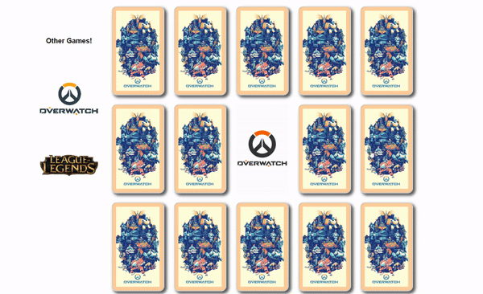

  
  
  
  

My mother taught me to be fearless in the face of challenges, curious, and generous. Just remember when faced with anxiety, to take your time.

See [my website](https://jerrylafumedev.com/) for more information!

---

## Projects
<table bordercolor="#66b2b2">
  <tr>
    <td width="33%" valign="top">
      <h3>Givr</h3>
         
        
<a target="_blank" href="https://github.com/JerryLafumeDev/Givr">Repo</a> // <a target="_blank" href="https://givr-donate.herokuapp.com/">Site</a>

         
        
        
<strong>Javascript, Bootstrap, Socket.io, Node.js, & Express.js</strong> - A full stack web application that is centered around donations. Where users can post donations or receive donations from each other.

    </td>
    <td width="33%" valign="top">
      <h3>High Anxiety</h3>
         
        
<a target="_blank" href="https://github.com/JerryLafumeDev/HighAnxiety">Repo</a> // <a target="_blank" href="https://jerrylafumedev.github.io/HighAnxiety/">Site</a>

         
        
        
<strong>HTML5, CSS3, Bootstrap, Javascript</strong> - A Online Fashion store based off one of my favorite clothing brands. I've always wanted to make one of these.

    </td>
  </tr>
</table>
<table>
  <tr>
    <td width="33%" valign="top">
      <h3>Glitcher</h3>
         
        
<a target="_blank" href="https://github.com/JerryLafumeDev/Glitcher">Repo</a> // <a target="_blank" href="https://glitcher-jl.herokuapp.com/">Site</a>

         
        
        
<strong>HTML5, Bootstrap, Twitch API, Node.js, & Express.js</strong> - A social media platform created by gamers for gamers. Think instagram but over done, with moving parts and flashing lights.

    </td>
    <td width="33%" valign="top">
      <h3>Talot Matcher</h3>
         
        
<a target="_blank" href="https://github.com/JerryLafumeDev/Talot-Matcher">Repo</a> // <a target="_blank" href="https://jerrylafumedev.github.io/Talot-Matcher/">Site</a>

         
        
        
<strong>HTML5, CSS3, & Javascript</strong> - I created Talot cards based off of two of my favorite video games, Overwatch and League of Legends. Lets see if you can match them all!

    </td>
  </tr>
</table>
